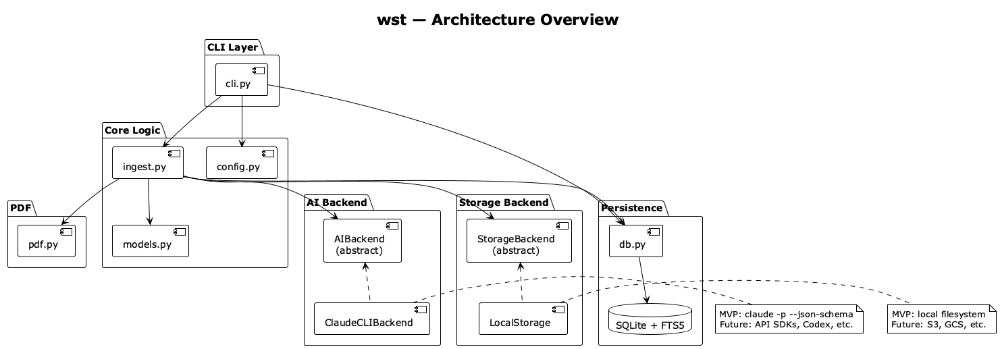
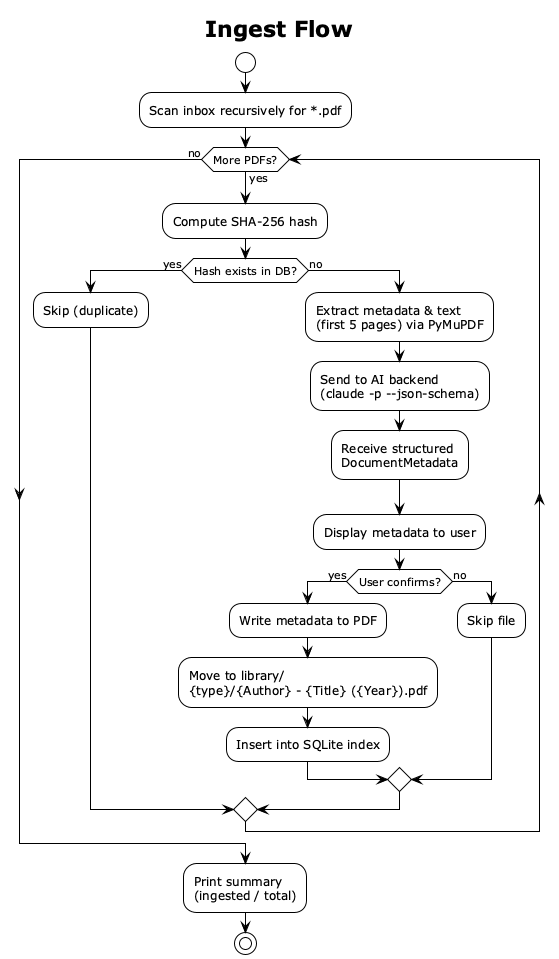
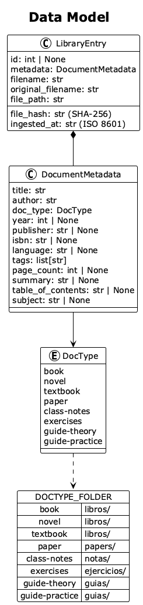
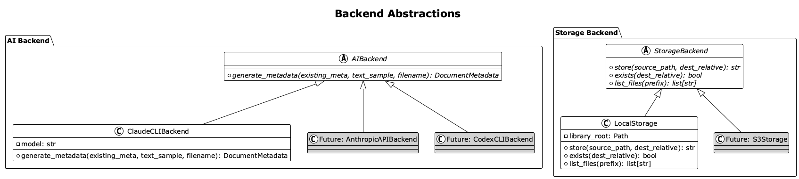

# wst — Architecture & Design

## Overview

wst is a CLI tool that organizes books and PDFs into a structured library with AI-generated metadata and a searchable SQLite index. The architecture separates core logic from the CLI layer and uses abstract backends for AI and storage, enabling future extension to API-based AI, S3 storage, and desktop/mobile frontends.

## Architecture



The system is composed of:

- **CLI Layer** (`cli.py`): Thin Click-based CLI that parses arguments and delegates to core logic.
- **Core Logic** (`ingest.py`, `models.py`, `config.py`): Orchestration, data models, and configuration. This layer is frontend-agnostic — a desktop or mobile app would import the same modules.
- **PDF** (`pdf.py`): Reads metadata and text from PDFs via PyMuPDF, writes metadata back.
- **Persistence** (`db.py`): SQLite database with FTS5 for full-text search over metadata fields.
- **AI Backend** (`ai.py`): Abstract interface for AI-powered metadata generation. MVP uses the `claude` CLI with structured JSON output.
- **Storage Backend** (`storage.py`): Abstract interface for file storage. MVP uses the local filesystem.

## Ingest Flow



The ingest pipeline processes each PDF through these steps:

1. **Hash check**: Compute SHA-256 and check against the database to skip duplicates.
2. **Extract**: Read existing PDF metadata and text from the first 5 pages using PyMuPDF.
3. **AI generation**: Send extracted data to the AI backend, which returns a structured `DocumentMetadata` object. The Claude CLI backend uses `--json-schema` to enforce the Pydantic model schema.
4. **User confirmation**: Display the generated metadata and prompt for confirmation.
5. **Write metadata**: Update the PDF's internal metadata fields (title, author, subject).
6. **Store**: Move the file to the library under `{type}/{Author} - {Title} ({Year}).pdf`.
7. **Index**: Insert the full metadata record into SQLite with FTS5 indexing.

## Data Model



### DocumentMetadata

The core model shared with the AI backend. Contains all catalog fields:

| Field | Type | Description |
|-------|------|-------------|
| `title` | str | Document title |
| `author` | str | Author name(s) |
| `doc_type` | DocType | Classification (book, paper, etc.) |
| `year` | int? | Publication year |
| `publisher` | str? | Publisher name |
| `isbn` | str? | ISBN if applicable |
| `language` | str? | ISO 639-1 code |
| `tags` | list[str] | Topics and keywords |
| `page_count` | int? | Total pages |
| `summary` | str? | Brief description (2-3 sentences) |
| `table_of_contents` | str? | Chapter listing |
| `subject` | str? | Broad knowledge area |

### LibraryEntry

Wraps `DocumentMetadata` with storage and tracking fields: `id`, `filename`, `original_filename`, `file_path`, `file_hash` (SHA-256), and `ingested_at` (ISO 8601 timestamp).

### DocType → Folder Mapping

| DocType | Folder |
|---------|--------|
| book, novel, textbook | `libros/` |
| paper | `papers/` |
| class-notes | `notas/` |
| exercises | `ejercicios/` |
| guide-theory, guide-practice | `guias/` |

## Backend Abstractions



### AI Backend

The `AIBackend` abstract class defines a single method:

```python
def generate_metadata(existing_meta, text_sample, filename) -> DocumentMetadata
```

The MVP implementation (`ClaudeCLIBackend`) calls `claude -p --output-format json --json-schema <schema>` as a subprocess. The JSON schema is derived from `DocumentMetadata.model_json_schema()`, so the AI output is validated against the Pydantic model automatically.

Future implementations can use the Anthropic Python SDK, OpenAI-compatible APIs, or other CLI tools — each as a new subclass, no changes to core logic.

### Storage Backend

The `StorageBackend` abstract class defines three methods:

```python
def store(source_path, dest_relative) -> str
def exists(dest_relative) -> bool
def list_files(prefix) -> list[str]
```

The MVP implementation (`LocalStorage`) uses `shutil.move` and local filesystem operations. A future `S3Storage` would implement the same interface with boto3.

## SQLite Schema

The `documents` table stores all metadata fields plus tracking columns. Indexes on `author`, `doc_type`, and `year` accelerate filtered queries.

An FTS5 virtual table (`documents_fts`) indexes `title`, `author`, `tags`, `subject`, and `summary` for full-text search. Triggers keep the FTS index in sync with inserts and deletes.

Only metadata is stored in the database — no PDF content. A 1000-page book occupies the same ~500 bytes as a 50-page paper.

## Project Structure

```
src/wst/
├── __init__.py       # Package marker
├── cli.py            # Click CLI commands (thin layer)
├── models.py         # Pydantic models: DocType, DocumentMetadata, LibraryEntry
├── config.py         # WstConfig with defaults
├── pdf.py            # PyMuPDF: extract and write PDF metadata
├── db.py             # SQLite + FTS5 database operations
├── ai.py             # AI backend abstraction + Claude CLI implementation
├── storage.py        # Storage backend abstraction + local filesystem implementation
└── ingest.py         # Ingest orchestration pipeline
```

## Building Diagrams

The PlantUML sources are in `docs/plantuml/`. To compile them to PNG:

```bash
make docs
```

Requires [PlantUML](https://plantuml.com/) installed (`brew install plantuml`).
